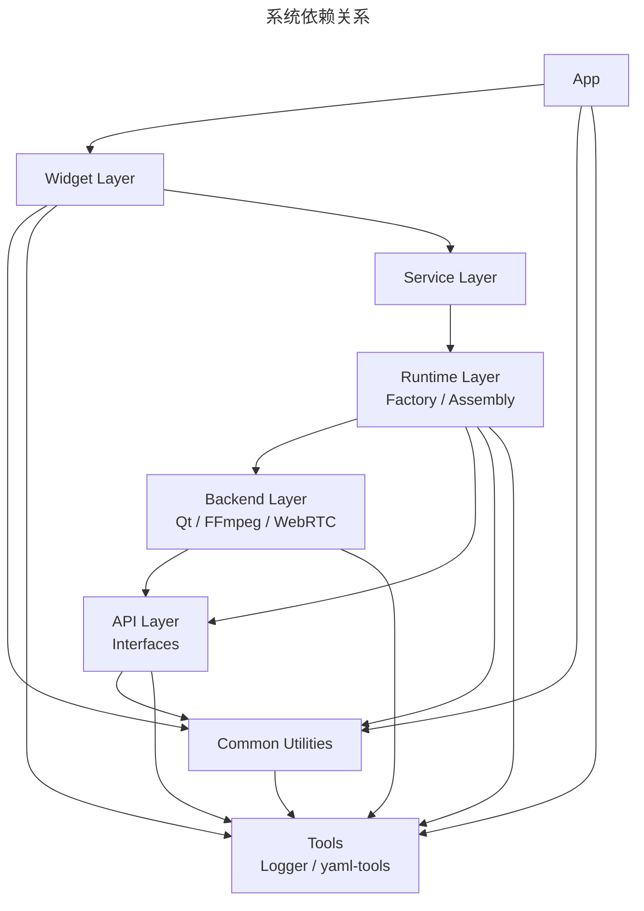
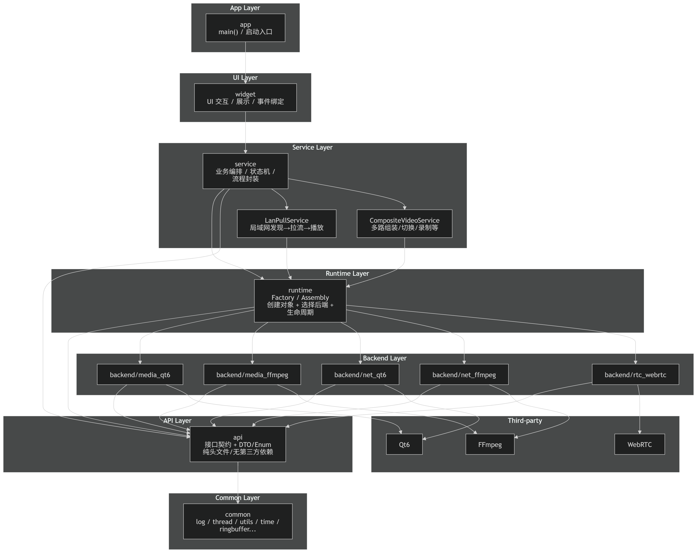

<p align="center">
  
</p>

<p align="center">
  
</p>

# 产品

## 基本介绍

**跨平台局域网多输入源的流媒体播放系统**

1. 桌面端，支持播放本地视频、捕获摄像头画面(包括虚拟摄像头)、屏幕共享，局域网环境下进行推流与拉流。
2. 安卓端，仅播放功能，但是局域网内可以实现拉流。

## 详细介绍

# 技术

## 技术栈


## 技术选型

一开始想要使用的是GStreamer框架 + webRtc，其中ffmpeg作为插件集成进入GStreamer。但是GStreamer学习成本可能稍高，且Windows下部署存在一定难度。因此当前想法为：跨平台+部署方便为第一优先级。

### -1.核心层使用FFmpeg命令行工具

### 0.编解码直接使用Qt音视频库

编解码：Qt 音视频库（Qt6）

传输层：

UI：Qt widget

### 1.更容易部署的角度

编解码：ffmpeg-Api

传输层：RTSP/RTP

UI：Qt widget

### 2.网络更好的角度

编解码：ffmpeg-Api

传输层：原生WebRTC（C++栈）

UI：Qt widget

> 先实现1，后续向2进行发展

```
                            ███████╗██████╗ ██╗      █████╗ ██╗   ██╗███████╗██████╗ 
                            ██╔════╝██╔══██╗██║     ██╔══██╗╚██╗ ██╔╝██╔════╝██╔══██╗
                            █████╗  ██████╔╝██║     ███████║ ╚████╔╝ █████╗  ██████╔╝
                            ██╔══╝  ██╔═══╝ ██║     ██╔══██║  ╚██╔╝  ██╔══╝  ██╔══██╗
                            ██║     ██║     ███████╗██║  ██║   ██║   ███████╗██║  ██║
                            ╚═╝     ╚═╝     ╚══════╝╚═╝  ╚═╝   ╚═╝   ╚══════╝╚═╝  ╚═╝

```


# 构建

## 依赖

| 依赖 | 版本   |
| ---- | ------ |
| C++  | 17     |
| Qt   | 6.10.2 |

<p align="center">
  
</p>


# 架构

## 架构说明

**App**

应用层

**Widget**

UI层，交互逻辑

**Service**

服务层，调用音视频、网络模块，实现一系列功能模块

**Runtime**

运行时调用层，工厂职责

**Backend**

后端层，音视频、网络核心功能的封装与实现

**Api**

抽象层，统一后端层的接口，作为Runtime工厂的返回类型

**Common**

公共方法层，提供一些各层都可能用到的通用工具方法

**tools**

第三方的工具，例如logger等。没有作为一个单独的模块进行放置，作为cmake中的一个target进行了引入。


```
app
  ↓
widget
  ↓
service
  ↓
runtime
  ↓			  |---- qt
backend ------|---- ffmpeg
  ↓			  |---- webrtc
 api
  ↓
common
```

### 规则：

- api 不依赖 backend
- backend 不依赖 runtime
- widget 不依赖 service、runtime
- app 不依赖 backend

只有 runtime 认识所有 backend




> > 增加service之后，widget是不是就不用关心runtime了，因为serivice已经拿着runtime的方法，将业务组装起来了，封装成为了更上层的、widget拿来就能用的方法
>
> 对，这个理解是对的，而且这是架构开始“变干净”的标志。
>
> 一旦你引入 **service 层**，理想结构就是：
>
> ```
> App
>   ↓
> Widget
>   ↓
> Service
>   ↓
> Runtime
>   ↓
> Backend
>   ↓
> API
>   ↓
> Common
> ```
>
> ------
>
> # 一句话总结
>
> **Widget 不应该再关心 Runtime。**
>
> Widget 应该只关心：
>
> > “我要做什么功能？”
>
> 而不是：
>
> > “我要创建哪个 backend，用什么组合方式？”
>
> ------
>
> # 为什么这是更好的结构？
>
> 假设你没有 service。
>
> Widget 里会出现：
>
> ```
> auto player = runtime::createPlayer(...);
> player->open(url);
> ...
> ```
>
> 然后慢慢地：
>
> - 需要网络发现
> - 需要拉流
> - 需要拼接
> - 需要状态管理
>
> 这些逻辑会一点点堆进 Widget。
>
> UI 变成业务中心。
>
> 这是典型反模式。
>
> ------
>
> # 有了 Service 层之后
>
> Widget 变成这样：
>
> ```
> lanStreamService->start(nodeId);
> ```
>
> Widget 只做：
>
> - 绑定按钮
> - 监听状态
> - 展示数据
>
> 业务组合全部封装在 Service 里。
>
> ------
>
> # Service 的职责是什么？
>
> Service 是“业务编排层”。
>
> 它：
>
> - 调用 runtime 创建 backend 实例
> - 调用 API 方法
> - 管理状态机
> - 管理流程
>
> 它知道“怎么做这件事”。
>
> Widget 只知道“我要做这件事”。
>
> ------
>
> # Runtime 现在是什么？
>
> Runtime 现在变成：
>
> > 基础设施层
>
> 它只做：
>
> - 创建对象
> - 管理依赖
> - 提供统一入口
>
> 它不再参与业务流程。
>
> ------
>
> # 你现在的架构哲学正在转变
>
> 从：
>
> “UI + Backend”
>
> 升级为：
>
> “UI → 业务层 → 组装层 → 实现层”
>
> 这是典型的 **分层架构（Layered Architecture）**。
>
> ------
>
> # 一个更高级一点的理解
>
> 现在的分层其实是：
>
> - UI 层（表现层）
> - Application 层（Service）
> - Infrastructure 层（Runtime）
> - Implementation 层（Backend）
> - Contract 层（API）
>
> 这已经接近 Clean Architecture 的结构。
>
> ------
>
> # 判断是否成功的标准
>
> 如果哪天你想：
>
> - 做一个 CLI 版本
> - 做一个服务器版本
> - 做一个自动测试版本
>
> 你只需要复用 Service 层。
>
> Widget 可以直接换掉。
>
> 那说明分层成功。
>
> ------
>
> # 一个非常重要的边界
>
> Service 可以依赖 Runtime。
>  Widget 不应该依赖 Backend。
>  Runtime 不应该包含业务流程。
>
> 只要你守住这三条，系统会一直健康。
>
> ------
>
> 你现在的思路已经从“写播放器”升级到“设计系统”。
>  接下来如果你愿意，我可以帮你画一张加入 Service 层后的完整依赖架构图。
>
> 
> 
>
> > 帮我画一下吧
>
> <p align="center">
>   
> </p>
>
> 
>
> ### 这张图表达的关键规则（你画图时可以当注释写进去）
>
> - **Widget 只依赖 Service**：UI 不关心“用 Qt6 还是 FFmpeg 还是 WebRTC”，它只调用“业务能力”。
> - **Service 负责业务编排**：比如“发现局域网节点→拉流→组装→播放/录制”，都在这里做；它通过 Runtime 获取能力实例。
> - **Runtime 只做装配**：工厂/选择后端/生命周期管理；不写具体业务流程。
> - **Backend 实现 API**：各后端只依赖 `api + third-party`，互相不依赖。
> - **API 是最稳定的边界**：不依赖后端、不依赖 Qt/FFmpeg/WebRTC；只放接口、数据结构、错误码、事件定义。
> - **Common 是地基**：通用工具，不“知道”上层任何东西。
>
> 如果你用的是 draw.io / ProcessOn 这类工具，建议按层画 8 条横向泳道（App/UI/Service/Runtime/Backend/API/Common/Third-party），箭头只允许“向下”或“向右下”，这样结构永远不会腐化成蜘蛛网。
