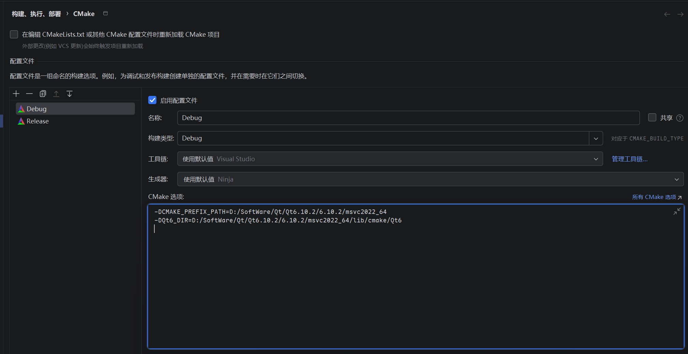

<p align="center">
  
</p>
<p align="center">
  
</p>

# 产品

## 基本介绍

**跨平台局域网多输入源的流媒体播放系统**

1. 桌面端，支持播放本地视频、捕获摄像头画面(包括虚拟摄像头)、屏幕共享，局域网环境下进行推流与拉流。
2. 安卓端，仅播放功能，但是局域网内可以实现拉流。

## 详细介绍

# 技术

## 技术栈


## 技术选型

一开始想要使用的是GStreamer框架 + webRtc，其中ffmpeg作为插件集成进入GStreamer。但是GStreamer学习成本可能稍高，且Windows下部署存在一定难度。因此当前想法为：跨平台+部署方便为第一优先级。

### -1.核心层使用FFmpeg命令行工具

### 0.编解码直接使用Qt音视频库

编解码：Qt 音视频库（Qt6）

传输层：

UI：Qt widget

### 1.更容易部署的角度

编解码：ffmpeg-Api

传输层：RTSP/RTP

UI：Qt widget

### 2.网络更好的角度

编解码：ffmpeg-Api

传输层：原生WebRTC（C++栈）

UI：Qt widget

> 先实现1，后续向2进行发展

```
                            ███████╗██████╗ ██╗      █████╗ ██╗   ██╗███████╗██████╗ 
                            ██╔════╝██╔══██╗██║     ██╔══██╗╚██╗ ██╔╝██╔════╝██╔══██╗
                            █████╗  ██████╔╝██║     ███████║ ╚████╔╝ █████╗  ██████╔╝
                            ██╔══╝  ██╔═══╝ ██║     ██╔══██║  ╚██╔╝  ██╔══╝  ██╔══██╗
                            ██║     ██║     ███████╗██║  ██║   ██║   ███████╗██║  ██║
                            ╚═╝     ╚═╝     ╚══════╝╚═╝  ╚═╝   ╚═╝   ╚══════╝╚═╝  ╚═╝

```

# 构建

## 依赖

| 依赖 | 版本   |
| ---- | ------ |
| C++  | 17     |
| Qt   | 6.10.2 |




